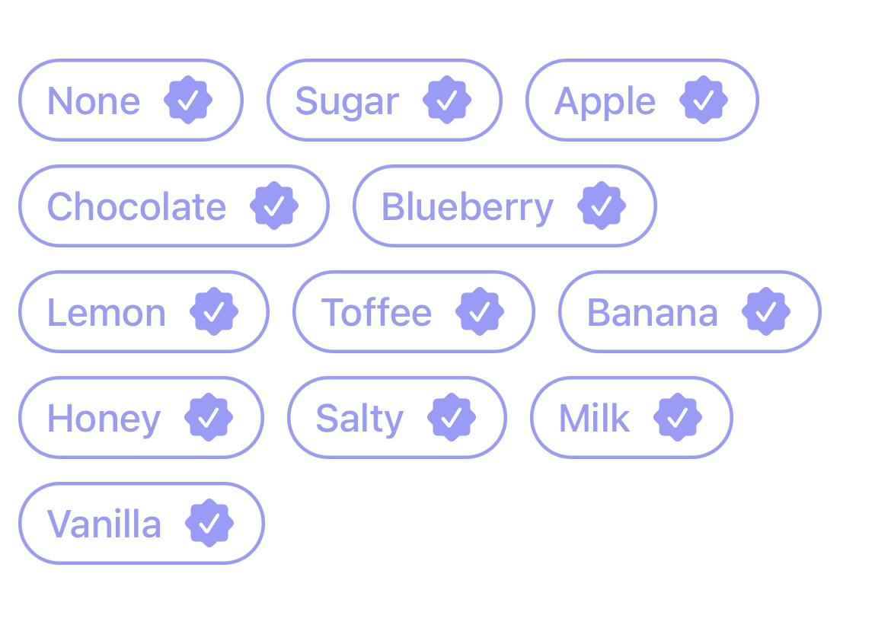
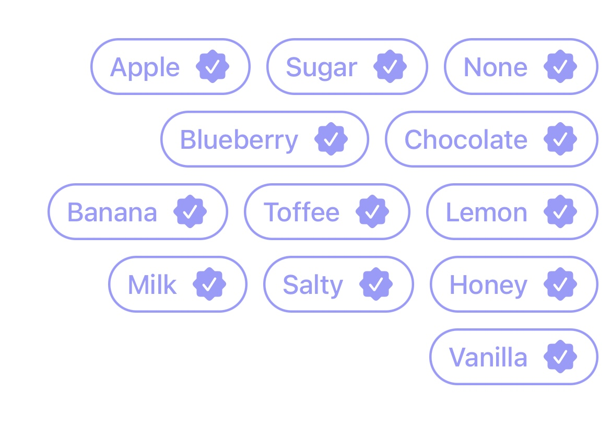
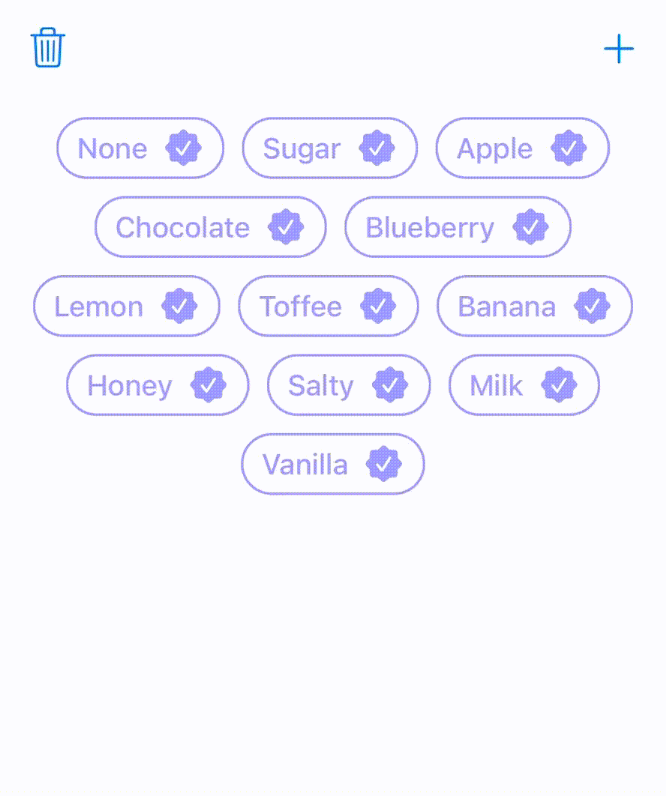

# TagsFlowLayout

This implementation is built using a `UICollectionView` and a custom flowLayout.

<a href="https://github.com/rastaman111/VerticalFlowLayout">
    
</a>
<a href="https://github.com/Carthage/Carthage">
    
</a>   

<a href="https://github.com/rastaman111/VerticalFlowLayout/blob/master/LICENSE">
    
</a>

<a href="https://cocoapods.org/pods/VerticalCardSwiper">
    
</a>

<a href="https://swift.org/blog/swift-5-released/">
    
</a>

### Horizontal Alignment:

* `horizontalAlignment = .left`

<div>  </div>

* `horizontalAlignment = .right`

<div>  </div>

* `horizontalAlignment = .center`

<div>  </div>

### Inserting and Deleting tags

<div>  </div>

# Table of contents

  * [Requirements](#requirements)
  * [Installation](#installation)
     - [CocoaPods](#cocoapods)
     - [Swift Package Manager](#swift-package-manager)
     - [Carthage](#carthage)
     - [Manually](#manually)
  * [Usage](#usage)
  * [License](#license)
  * [Donation](#donation)

## Requirements
* iOS 11.0+
* Swift 5

## Installation

### CocoaPods
Add Instructions to your Podfile:

```ruby
pod 'TagsFlowLayout'
```

Then, run the following command:

```bash
$ pod install
```

### Swift Package Manager
In Xcode, use File > Swift Packages > Add Package Dependency and use `https://github.com/rastaman111/TagsFlowLayout`.

### Carthage
To install with [Carthage](https://github.com/Carthage/Carthage), simply add the following line to your Podfile:
```ruby
github "rastaman111/TagsFlowLayout"
```

### Manually
If you prefer not to use any of dependency managers, you can integrate manually. Put `Sources/TagsFlowLayout` folder in your Xcode project. Make sure to enable `Copy items if needed` and `Create groups`.

## Usage
To use `TagsFlowLayout` inside your `UIViewController`:

```swift
import TagsFlowLayout

class ViewController: UICollectionViewController {
   
    override func viewDidLoad() {
        super.viewDidLoad()
        
        let tagsFlowLayout = TagsFlowLayout(alignment: .left ,minimumInteritemSpacing: 10, minimumLineSpacing: 10, sectionInset: UIEdgeInsets(top: 10, left: 10, bottom: 10, right: 10))
        collectionView.collectionViewLayout = tagsFlowLayout
        
        // register cell
        collectionView.register(nib: UINib(nibName: "ExampleCell", bundle: nil), forCellWithReuseIdentifier: "ExampleCell")
    }
    
   override func collectionView(_ collectionView: UICollectionView, cellForItemAt indexPath: IndexPath) -> UICollectionViewCell {
        let cell = collectionView.dequeueReusableCell(withReuseIdentifier: "ExampleCell", for: indexPath) as! ExampleCell
        
        cell.maxWidth = collectionView.bounds.width - 30

        return cell
    }
}
```
```swift
class TagCollectionViewCell: UICollectionViewCell {
    
    @IBOutlet weak var tagLabel: UILabel!
    
    @IBOutlet private var maxWidthConstraint: NSLayoutConstraint! {
        didSet {
            maxWidthConstraint.isActive = false
        }
    }
    
    var maxWidth: CGFloat? = nil {
        didSet {
            guard let maxWidth = maxWidth else {
                return
            }
            maxWidthConstraint.isActive = true
            maxWidthConstraint.constant = maxWidth
        }
    }
}
```
## License
TagsFlowLayout is available under the MIT license. See the LICENSE file for more info.

## Donation
<a href="https://www.buymeacoffee.com/SoundBar" target="_blank"></a>
